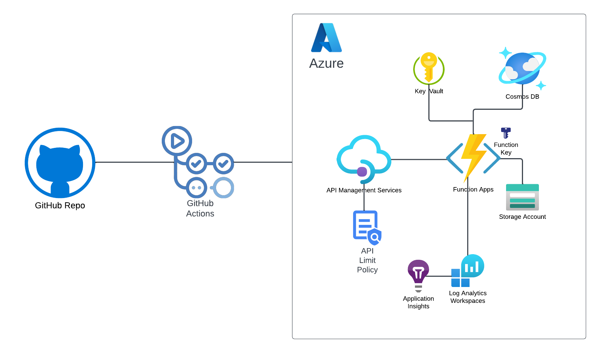
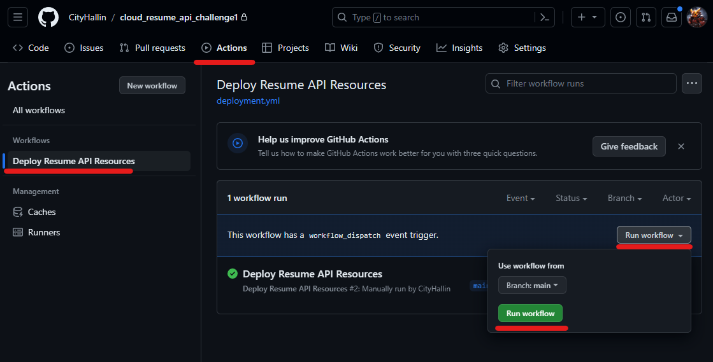
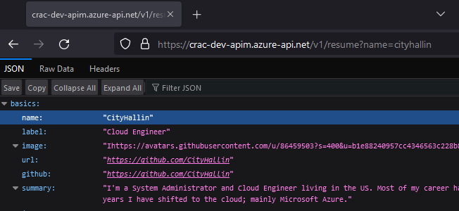
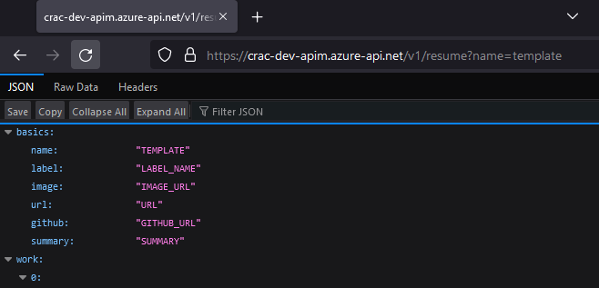
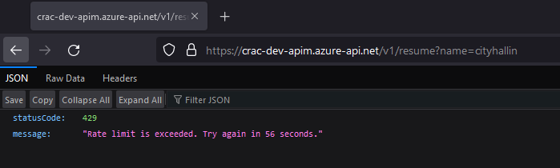

# Cloud Resume API Challenge

- [Overview](#overview)
- [Initial Setup](#initialsetup)
- [Instructions](#instructions)
- [Other Information](#other)


<br />

## Overview <a name="overview"></a>
This project is based on the [Cloud Resume API Challenge](https://cloudresumeapi.dev/) made by [Rishab Kumar](https://github.com/rishabkumar7). This project uses  Azure and its cloud-native resources allowing the creation of an API that will output resume JSON information. This project will use the following technologies:

- Azure CLI
- GitHub Actions
- GitHub CLI
- Microsoft Azure
    - API Management
    - Application Insights
    - CosmosDB
    - Entra App Registration
    - Function Apps
    - Key Vault
    - Log Analytics Workspace
    - Storage Account
- PowerShell
- Terraform

> I purposely left certain information exposed in the Action logs so people can see more details for learning purposes. I have already remove or updated all of the Azure resources, IPs, and other pieces of data. 

## Initial Setup <a name="initialsetup"></a>

> These initial tasks just need to be run once at the very beginning of the project in order to set up some dependencies in your GitHub Repo.

- Make sure the following tools are installed on your local machine:
    - [Azure CLI](https://learn.microsoft.com/en-us/cli/azure/install-azure-cli)
    - [GitHub CLI](https://github.com/cli/cli#installation)

- In your Azure Subscription, create an [Entra App Registration Service Principal](https://learn.microsoft.com/en-us/entra/identity-platform/quickstart-register-app). Give that service principal proper access in your subscription to build resources and add Azure Role Assignments to those resources.

- Log into your GitHub Account.

- Fork this GitHub repo to your own GitHub account.

- Clone this repo from your GitHub account to your local machine.

- Gather the following information from your Azure tenant. You will need this information in a few minutes:
    - Entra App Registration Application Client ID
    - Entra App Registration Application Client Secret
    - Entra Tenant ID
    - Azure Subscription ID
    
- An initial Resource Group and Storage Account will need to be created in order to hold the Terraform state files, as well as GitHub Secrets. Run the PowerShell script [initial_setup.ps1](https://github.com/CityHallin/cloud_resume_api_challenge/blob/main/files/initial_setup.ps1) from the locally cloned repo on your local machine to help with this process. The initial_setup.ps1 script:
    -  Will prompt you for the information below:
        - Entra App Registration Application Client ID
        - Entra App Registration Application Client Secret
        - Entra Tenant ID
        - Azure Subscription ID
    - Will automatically create the needed Storage Account for the Terraform State files.
    - Will ask you for the local clone folder path of your GitHub repo on your local machine. This is needed in order for GitHub CLI to place the secrets into the correct repo.
    - Will log you into your GitHub account. Choose the following when prompted:
        - What is your preferred protocol for Git operations on this host? **HTTPS**
        - Authenticate Git with your GitHub credentials? **No**
        - How would you like to authenticate GitHub CLI? **Login with a web browser**
    - Will automatically create the needed GitHub secrets in the online version of the GitHub repo. 

> Example of the initial_setup.ps1 run:

```
PS D:\repos\cloud_resume_api_challenge\files> .\initial_setup.ps1

Adding default parameters

Prompting for more info

Enter Entra App Registration Client ID: ************************************

Enter Entra App Registration Client Secret: ****************************************

Enter Entra Tenant ID: ************************************

Enter Azure Subscription ID: *************************************

Run Azure Storage Account setup for backend services? (y/n)
 : y

Log into your Azure account

Creating Resource Group

Creating Storage Account

Creating Blob Container

Run GitHub Secrets and Variables Setup? (y/n)
 : y

Enter folder path to the cloned local repo
 : D:\repos\cloud_resume_api_challenge

GitHub Login
? What is your preferred protocol for Git operations on this host? HTTPS
? Authenticate Git with your GitHub credentials? No
? How would you like to authenticate GitHub CLI? Login with a web browser

! First copy your one-time code: 9999-9999
Press Enter to open github.com in your browser... 

✓ Authentication complete.
✓ Configured git protocol
✓ Logged in as GitHubUser

Creating GitHub Secrets
✓ Set Actions secret ENTRA_CLIENT_ID for CityHallin/cloud_resume_api_challenge
✓ Set Actions secret ENTRA_CLIENT_SECRET for CityHallin/cloud_resume_api_challenge
✓ Set Actions secret ENTRA_TENANT_ID for CityHallin/cloud_resume_api_challenge
✓ Set Actions secret AZURE_SUBSCRIPTION_ID for CityHallin/cloud_resume_api_challenge
✓ Set Actions secret TERRAFORM_SA_RG_NAME for CityHallin/cloud_resume_api_challenge
✓ Set Actions secret TERRAFORM_SA_NAME for CityHallin/cloud_resume_api_challenge
✓ Set Actions secret TERRAFORM_SA_CONTAINER_NAME for CityHallin/cloud_resume_api_challenge
PS D:\repos\cloud_resume_api_challenge>

```

- This completes the initial setup. Your GitHub online repo should now have everything it needs to get started. 

## Instructions <a name="instructions"></a>

- In your online GitHub account, navigate to your GitHub Cloud Resume API Challenge repo > Actions. Click on the Action called **Deploy Resume API Resources**, click on the **Run Workflow** drop down menu and select **Run Workflow** green button to start the action. This will start the GitHub action to build everything needed in Azure. This process takes about 5-10 minutes. 

<br />

<br />

- Once the GitHub Action is complete, next we need to populate your CosmosDB database with a document item of your resume. Create a JSON file of your resume. You can use the template from this repo as guidance: [resume_example.json](https://github.com/CityHallin/cloud_resume_api_challenge/blob/main/files/resume_example.json)

- Run the [create_database_item.ps1](https://github.com/CityHallin/cloud_resume_api_challenge/blob/main/files/create_database_item.ps1) script from this repo to add a document item to your CosmosDB. The create_database_item.ps1 script:
    -  Will prompt you for the information below:
        - CosmosDB Account Name: Grab this information from the Azure Portal. 
        - CosmosDB Database Name: This project defaults to using the name **resume**. 
        - CosmosDB Container Name: This project defaults to using the name **profiles**. 
        - CosmosDB Account Access Key: Grab the Read/Write access key from your CosmosDB account via the Azure Portal.
        - Folder path to the JSON file on your local machine it will upload to the CosmosDB

```
PS D:\repos\cloud_resume_api_challenge\files> .\create_database_item.ps1

Enter CosmosDB Account Name (not URL, just resource name)
 : azrac-dev-cdb

Enter CosmosDB Database Name
 : resume

Enter CosmosDB Container Name
 : profiles

Enter CosmosDB Read-Write Key
 : ****************************************************************************************

Enter JSON file path that will be uploaded to database (example: C:\data\resume_example.json)
 : D:\repos\resume-api\files\resume_example.json

Output

id           : 99999999-9999-9999-9999-999999999999
basics       : @{name=TEMPLATE; label=LABEL_NAME; image=IMAGE_URL; url=URL; github=GITHUB_URL; summary=SUMMARY}
work         : {@{name=ORGANIZATION_NAME0; position=POSITION_TITLE; url=https://www.BUSINESS_NAME[.]com; startDate=YYYY-MM; endDate=YYYY-MM; highlights=HIGHLIGHT0 HIGHLIGHT1}, 
               @{name=ORGANIZATION_NAME1; position=POSITION_TITLE; url=https://www.BUSINESS_NAME[.]com; startDate=YYYY-MM; endDate=YYYY-MM; highlights=HIGHLIGHT0 HIGHLIGHT1}}
volunteer    : {@{organization=VOLUNTEEER_ORGANIZATION_NAME0; position=POSITION_TITLE; url=https://www.VOLUNTEE_NAME[.]com; startDate=YYYY-MM; endDate=YYYY-MM; summary=SUMMARY}, 
               @{organization=VOLUNTEEER_ORGANIZATION_NAME1; position=POSITION_TITLE; url=https://www.VOLUNTEE_NAME[.]com; startDate=YYYY-MM; endDate=YYYY-MM; summary=SUMMARY}}
education    : {@{institution=SCHOOL_NAME0; area=MAJOR_NAME; studyType=ACCREDITATION; startDate=YYYY-MM; endDate=YYYY-MM; gpa=GPA}, @{institution=SCHOOL_NAME1; area=MAJOR_NAME; 
               studyType=ACCREDITATION; startDate=YYYY-MM; endDate=YYYY-MM; gpa=GPA}}
awards       : {@{title=AWARD_NAME0; date=YYYY-MM; awarder=ORGANIZATION_NAME}, @{title=AWARD_NAME1; date=YYYY-MM; awarder=ORGANIZATION_NAME}}
skills       : {@{name=SKILL_NAME0; keywords=KEYWORD0 KEYWORD1}, @{name=SKILL_NAME1; keywords=KEYWORD0 KEYWORD1}}
interests    : {@{name=INTEREST_NAME0; keywords=KEYWORD0 KEYWORD1}, @{name=INTEREST_NAME1; keywords=KEYWORD0 KEYWORD1}}
references   : {@{name=REF_NAME0; email=REF_EMAIL; phone=REF_PHONE_NUMBER}, @{name=REF_NAME1; email=REF_EMAIL; phone=REF_PHONE_NUMBER}}
projects     : {@{name=PROJECT_NAME0; description=PROJECT_DESCRIPTION; startDate=YYYY-MM; endDate=YYYY-MM}, @{name=PROJECT_NAME1; description=PROJECT_DESCRIPTION; startDate=YYYY-MM; endDate=YYYY-MM}}
_rid         : bbbbAAAAAAAAAAAAAAA==
_self        : dbs/bbbAA==/colls/bbbbAAAAA005=/docs/bbbbAAAAAAAAAAAAAAA==/
_etag        : "99999999-9999-9999-9999-999999999999"
_attachments : attachments/
_ts          : 9999999999

PS D:\repos\cloud_resume_api_challenge1>
```

- Once you've uploaded your JSON resume item to CosmosDB, you're ready to test out your resume API. Use the format below for the URL and paste it into a browser. This project uses a query parameter called **name** as it allows you to display different profiles by searching the name field of the JSON. 

```
https://<APIM_NAME>.azure-api.net/v1/resume?name=<YOUR_NAME>
```

<br />


<br />

<br />

- An example is my personal Resume API URL below:
```
https://api.cityhallin.com/v1/resume?name=cityhallin
```

## Other Information <a name="other"></a>

- This project repo just holds files for the Azure Function App, pipeline, utility PowerShell scripts, and instructions. The bulk of the Terraform is located in another of my repos called [Terraform_Modules](https://github.com/CityHallin/terraform_modules).

- This project is using free or low cost Azure resources that are purposefully lower performance. If the API has not been queried in a while, the next time it is called, the service may take 5-10 seconds to spin up. 

- If you'd like to change the name of the project, update the **project** variable in the .\terraform\resume-deployment.tf file. This may be needed as some Azure resource names need to be globally unique. 

- This project uses an Azure API management service (APIM) to front the Azure Function App being used. It is being used in this case to control a global rate limit. If the API is hit too many times by anyone, it will globally send a 429 error where users will need to wait a set amount of time to hit it again. 

<br />

<br />

